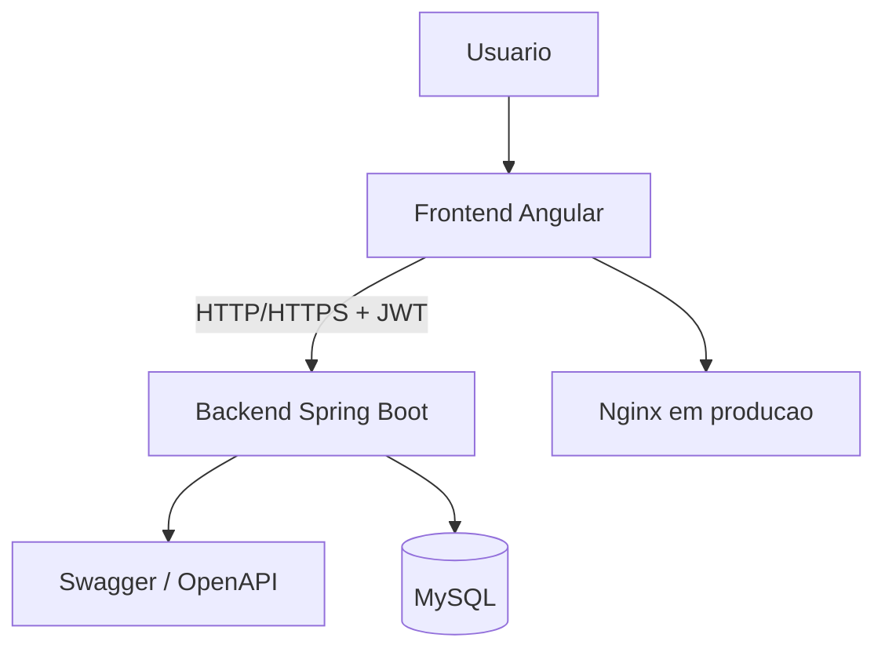

# Transcendence

Aplicacao full-stack com frontend Angular, backend Spring Boot em Kotlin, autenticacao com JWT, suporte a 2FA e Swagger/OpenAPI.

## Visao geral

O projeto e dividido em duas partes principais:

- Backend: API REST responsavel por autenticacao, autorizacao, 2FA, documentacao da API e acesso ao banco.
- Frontend: aplicacao Angular responsavel pela interface do usuario e pela comunicacao com o backend.

A infraestrutura local usa Docker e Docker Compose para orquestrar os servicos e simplificar a execucao tanto em desenvolvimento quanto em producao.

## Como o projeto e composto

### Backend

O backend fica em [Backend](Backend) e e implementado com Spring Boot + Kotlin. Ele expoe endpoints REST para:

- cadastro e login
- emissao e validacao de JWT
- configuracao e validacao de 2FA
- documentacao Swagger/OpenAPI

Arquivos importantes:

- [Backend/build.gradle.kts](Backend/build.gradle.kts)
- [Backend/src/main/kotlin/com/transcendence/demo/config/SecurityConfig.kt](Backend/src/main/kotlin/com/transcendence/demo/config/SecurityConfig.kt)
- [Backend/src/main/kotlin/com/transcendence/demo/config/OpenApiConfig.kt](Backend/src/main/kotlin/com/transcendence/demo/config/OpenApiConfig.kt)
- [Backend/src/main/resources/application-dev.properties](Backend/src/main/resources/application-dev.properties)
- [Backend/src/main/resources/application-prod.properties](Backend/src/main/resources/application-prod.properties)

### Frontend

O frontend fica em [Frontend](Frontend) e e uma aplicacao Angular. Em desenvolvimento, ele roda com hot reload. Em producao, ele e servido por Nginx.

Arquivos importantes:

- [Frontend/package.json](Frontend/package.json)
- [Frontend/nginx.conf](Frontend/nginx.conf)
- [Frontend/Dockerfile.dev](Frontend/Dockerfile.dev)

### Infraestrutura

Os ambientes sao definidos por dois arquivos de compose:

- [docker-compose.dev.yml](docker-compose.dev.yml): ambiente de desenvolvimento.
- [docker-compose.yml](docker-compose.yml): ambiente de producao.

O [Makefile](Makefile) aponta para o compose de desenvolvimento e facilita os comandos mais usados.

## Arquitetura



### Fluxo de execucao

1. O usuario acessa o frontend.
2. O frontend chama o backend para autenticar e acessar dados.
3. O backend valida credenciais, emite JWT e aplica as regras de seguranca.
4. O backend persiste dados no MySQL.
5. A documentacao da API e disponibilizada pelo proprio backend via Swagger.

## Dependencias

Para rodar localmente, voce precisa de:

- Docker
- Docker Compose
- Make

Se quiser executar fora do Docker, tambem precisa de:

- Java 23 para o backend
- Node.js 24 para o frontend

Observacao: o projeto foi organizado para funcionar bem com Docker, entao voce nao precisa instalar Java e Node localmente se for usar apenas os containers.

## Como rodar o projeto

### Desenvolvimento com Makefile

Este e o modo recomendado para desenvolvimento local.

Suba a stack completa:

```bash
make start
```

Veja os containers ativos:

```bash
make ps
```

Veja os logs:

```bash
make logs
```

Pare o ambiente:

```bash
make down
```

No ambiente de desenvolvimento, os servicos ficam em:

- Frontend: http://localhost:3000
- Backend: https://localhost:8082
- Swagger: https://localhost:8082/swagger-ui/index.html

### Desenvolvimento sem Makefile

Se preferir chamar o Compose diretamente:

```bash
docker compose -f docker-compose.dev.yml up --build -d
```

Esse comando sobe a mesma stack usada pelo Makefile.

### Producao / ambiente raiz

Para subir a configuracao de producao localmente:

```bash
docker compose -f docker-compose.yml up --build -d
```

Nesse modo, os servicos ficam em:

- Frontend: http://localhost:8080
- Backend: https://localhost:8081
- Swagger: https://localhost:8081/swagger-ui/index.html

## Backend em detalhe

O backend usa Spring Security, JWT, 2FA e springdoc-openapi.

Pontos importantes:

- Em desenvolvimento, o profile dev habilita HTTPS com certificado local.
- Em producao, o backend tambem roda com HTTPS usando o keystore informado por variaveis de ambiente.
- O Swagger e servido pelo proprio backend, nao por um container separado.
- As rotas de Swagger ja estao liberadas na configuracao de seguranca.

## Frontend em detalhe

O frontend e uma aplicacao Angular empacotada via Docker.

Em desenvolvimento:

- roda com hot reload
- escuta na porta 3000
- se comunica com o backend pela rede do Compose

Em producao:

- e servido por Nginx
- usa a porta 8080 no host

O Nginx tambem pode encaminhar requisicoes da interface para a API quando necessario.

## Banco de dados

O projeto usa MySQL via Docker.

- No desenvolvimento, o banco sobe junto com a stack de dev.
- No ambiente de producao, o banco sobe pela composicao principal.

As credenciais e nomes de database estao definidos nos arquivos de Compose e podem ser ajustados por variaveis de ambiente.

## Swagger / documentacao da API

A documentacao da API e fornecida pelo backend.

Acesse:

- Desenvolvimento: https://localhost:8082/swagger-ui/index.html
- Producao: https://localhost:8081/swagger-ui/index.html

Se o navegador alertar sobre certificado autoassinado, aceite a excecao durante o desenvolvimento.

## Comandos uteis

```bash
make start
make ps
make logs
make down
docker compose -f docker-compose.dev.yml logs backend
docker compose -f docker-compose.yml logs backend
```

## Troubleshooting

Se algo nao subir corretamente, verifique:

- se o comando usou o compose correto, dev ou producao
- se a porta acessada no navegador bate com a configuracao do ambiente
- se voce esta usando HTTPS quando o backend exige certificado
- se o container do backend terminou de iniciar sem erro
- se o banco MySQL subiu e ficou saudavel antes do backend

## Licenca

MIT