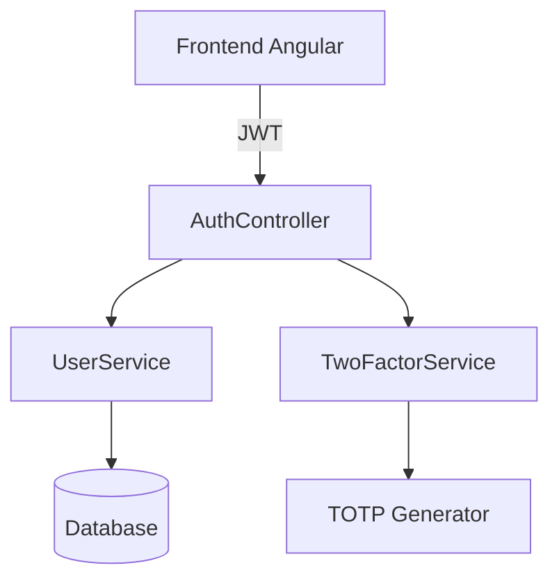
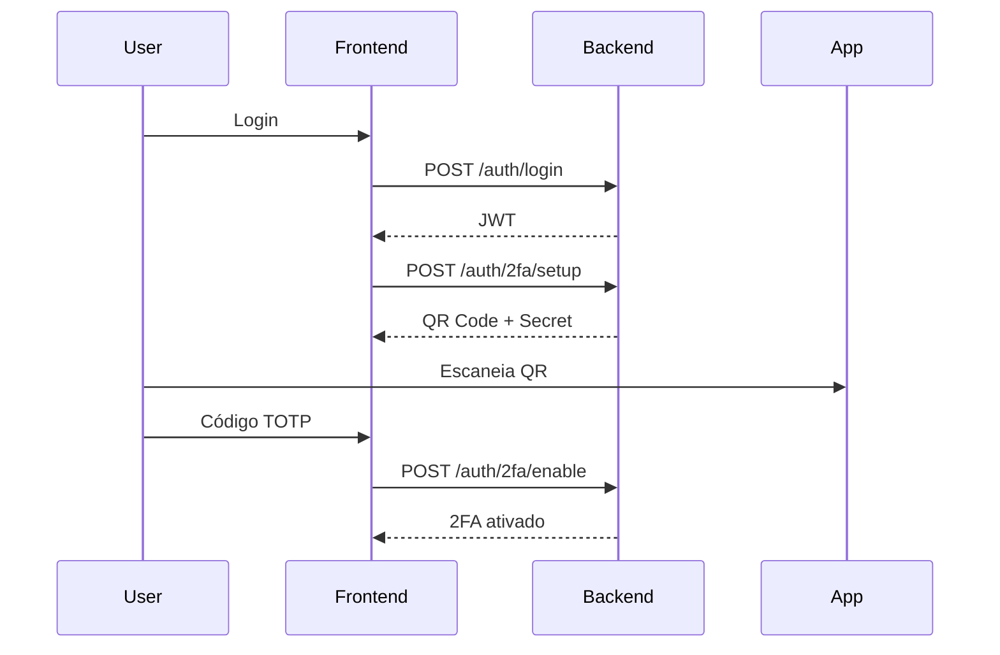

# 🔐 Auth Backend com 2FA (Spring Boot + Kotlin)


---

## 📌 Visão Geral

Backend para autenticação segura com suporte a **JWT + 2FA (TOTP)**.

* 🔑 Login com JWT
* 📱 Autenticação em dois fatores (Google Authenticator, Authy, etc.)
* 🔒 HTTPS com certificado local (dev)
* 🌐 Integração com frontend Angular

---

## 🧱 Arquitetura



### 🔍 Componentes

* **AuthController** → Entrada da API
* **UserService** → Regras de negócio (usuário)
* **TwoFactorService** → Geração e validação de TOTP
* **SecurityConfig** → Segurança e filtros JWT

---

## ⚙️ Stack

* Java 17+
* Kotlin
* Spring Boot
* Spring Security
* JWT
* TOTP (2FA)
* Docker (opcional)

---

## 🚀 Setup

### Pré-requisitos

* Java 17+
* Gradle (ou usar wrapper)
* Docker (opcional)

---

## 🔐 HTTPS (Dev)

```bash
./certs/generate-keystore.sh
```

Ou configure:

```bash
SSL_KEYSTORE_PATH=file:./certs/keystore-dev.p12
SSL_KEYSTORE_PASSWORD=changeit
```

---

## ▶️ Rodando o projeto

### Build

```bash
./gradlew build
```

### Run (dev)

```bash
./gradlew bootRun --args='--spring.profiles.active=dev'
```

---

## 🐳 Docker

```bash
docker compose -f docker-compose.dev.yml up --build
```

---

## 📘 Swagger

Acesse:

```
https://localhost:8081/swagger-ui/index.html
```

⚠️ Aceite o certificado autoassinado

---

## 🔑 Fluxo de Autenticação



---

## 🧪 Exemplos

### Login

```bash
curl -k -X POST "https://localhost:8081/auth/login" \
-H "Content-Type: application/json" \
-d '{"email":"user@email.com","password":"123"}'
```

---

### Gerar 2FA

```bash
curl -k -X POST "https://localhost:8081/auth/2fa/setup" \
-H "Authorization: Bearer SEU_TOKEN"
```

---

## 📱 QR Code

```html

```

---

## ⚠️ Troubleshooting

### 400 - JSON inválido

* Verifique formatação
* Use `Content-Type: application/json`

### 401 - Unauthorized

* Token inválido ou expirado

### CORS / Swagger

* Aceite certificado HTTPS
* Verifique origens permitidas

---

## 🛠️ Comandos úteis

```bash
./gradlew build
./gradlew bootRun
./gradlew test
```

---

## 🔮 Melhorias futuras

* Refresh Token
* Rate Limiting
* Auditoria de login
* Suporte a múltiplos dispositivos 2FA

---

## 📄 Licença

MIT
